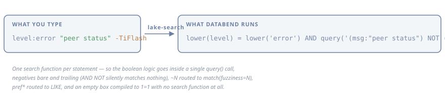

<h1 align="center">lake-search</h1>

<p align="center">
  <strong>Lucene-style search syntax, compiled to Databend SQL.</strong><br>
  A <code>$__search</code> macro for TiDB Cloud Lake and any other Databend-backed warehouse.
</p>

<p align="center">
  
  
  
  
</p>

<p align="center">
  <a href="#why">Why</a> • <a href="#quick-start">Quick start</a> • <a href="#syntax">Syntax</a> •
  <a href="#the-one-search-function-rule">Engine rules</a> • <a href="#grafana">Grafana</a> •
  <a href="#testing-against-a-real-warehouse">Conformance</a> • <a href="pipeline/">Pipeline</a>
</p>

Databend has a genuinely strong text-search engine — BM25 relevance through `score()`,
order-sensitive phrase search, English stemming, index-backed fuzzy matching, Ngram substring
search. What it has no equivalent of is the query *language* an engineer arriving from
Elasticsearch already knows. lake-search closes that gap by **translating** rather than passing
through, so the habits people already have either work or fail loudly.

- 🔍 **Lucene-style syntax** — `field:value`, `field:(a OR b)`, `"phrases"`, `AND`/`OR`, `-exclude`, `field:[a TO b]`, `field:>100`, `field:*`, `term~2`, `pref*`, `/regex/`, `term^2`
- 🧨 **Kills the silent failures** — a fuzzy `term~N` and a wildcard `*` return **zero rows and no error** inside this engine's search syntax; they are rewritten, not forwarded
- 🧠 **Knows the one-search-function rule** — boolean full-text logic is folded into a single `query()` call, because two search functions per statement is `[1065]`
- 🔁 **Rewrites what the engine gets wrong** — `a OR -b` has its negative clause silently dropped here, so De Morgan folds it into the one clause shape that evaluates correctly, still inside a single `query()`
- 🧮 **Excludes with an anti-join, not a bare `NOT`** — `NOT (query(x))` returns **zero** rows rather than every row when `x` matches nothing, so `-pdctl` used to blank the screen
- 📦 **Zero dependencies** — standard library only, so it vendors into a Grafana datasource plugin without dragging anything along
- 🔌 **Schema is data, not code** — describe your table in a JSON file (`-schema`) or pick a built-in (`-preset`); unknown fields route into a `VARIANT` bag, which is what makes open-ended log schemas searchable, and a schema that cannot support something says so when it loads rather than when a panel renders
- 📊 **A Grafana macro** — `$__search(msg, '$q')` expands in the datasource backend, retiring the hidden predicate-generating dashboard variable
- ✅ **Conformance by row count, not by exit code** — 98 cases across two fixtures asserting *relationships between counts*, because a wrong query here is indistinguishable from an empty result
- 🧪 **Verified live** — every engine claim below was measured on a running warehouse, not read off a doc page



## Quick start

```console
$ lake-search compile 'level:(error OR warn) region -snapshot'
((lower(level) = lower('error') OR lower(level) = lower('warn')) AND query('(msg:region) NOT (msg:snapshot)'))
```

One statement, one search function: the field-scoped group becomes ordinary SQL on a plain
column, and the full-text half — including its exclusion — folds into the single `query()` call
the engine allows. On the reference table that predicate returns 955 rows, 296 of them from the
last two hours.

```bash
go install github.com/choudharypankaj/lake-search/cmd/lake-search@latest
```

```
lake-search compile [-score] <query>    print the WHERE predicate
lake-search sql [-table T] <query>      print a complete SELECT
lake-search conform                     print the row-count conformance script
```

Or as a library:

```go
import "github.com/choudharypankaj/lake-search/databend"

schema, notes, err := databend.LoadSchema("my-logs.json") // or databend.Preset("k8s-logs")
// notes  -> "no severity field: a log view over this schema cannot colour …"
r, err := databend.CompileString(userInput, schema)
// r.SQL       -> predicate, safe to splice into WHERE
// r.Warnings  -> "this will be a full scan", "fuzziness ignored", …
// r.UsesMatch -> whether score() is legal alongside it
```

## Why

The gap is worse than a missing feature, because the familiar syntax does not error — it silently
returns nothing:

| What you type | What Databend does | What you conclude |
| --- | --- | --- |
| `snapshot~1` | `~1` is not understood; **0 rows** | "there are no matches" |
| `snapsh*` | the term is **truncated at the star**, and `snapsh` is not a token; **0 rows** | "prefix search is broken" |
| `snapshot*` | truncated to `snapshot`, which *is* a token; **full result set** | "prefix search works!" |
| `reg*on` | truncated at the star, so this searches for `reg`; **36 rows, none about regions** | "there were 36 region events" |
| `pod:tikv-??????` | `?` is not a wildcard, it is compared literally; **0 rows** | "no pods match" |
| `no`, `not`, `to`, `is` | 33 English stopwords are deleted from the query; **0 rows** | "the word isn't in the logs" |
| `"not ready"` | the phrase loses `not` and stops being a phrase; **9x too many rows** | "there are 2,320 of these" |
| `"peer stat*"` | inside quotes the star is punctuation: the phrase splits there and `stat` is not a token; **0 rows** against 88,441 for `peer status` | "there are no peer status lines" |
| `msg:not` | the value is read as an operator and the filter disappears; **every row** | "everything matches" |
| `http://a.com` | the colon reads as a field selector; **0 rows** | "that URL isn't in the logs" |
| `-absent_term` | the search function prunes the scan; **0 rows** | "nothing survives the exclusion" |
| *(empty box)* | `match(col,'')` matches nothing; **0 rows** | "there are no logs" |
| a word the collector parsed out of the message | `err=RemoteStopped` is moved into the `kv` bag, so `RemoteStopped` is not in `msg` any more; **0 rows** against 605 for the same word in the reconstructed line | "that error never happened" |
| `latency_ms:>30` on a bag key | one non-numeric value anywhere in that key fails the **whole statement**: `[1006] invalid float literal ... to_float64('Some(25)')`, where the truth is 39,140 rows | "the query is broken" |
| `err:RemoteStopped` through the index alone | `query()` is tokenised and stemmed, so it matches a value merely *containing* a token that stems to the term: `kv.request:command` is **501 rows** whose value is `batch_commands`, where the equality is 0 | "501 requests were `command`" |

Every row above is rewritten into SQL that answers the question that was asked, with one
exception, and the exception is marked: `"peer stat*"` is **explained rather than rewritten**.
Quotes and a wildcard ask for contradictory things — one says "these exact characters in this
order", the other says "any token shaped like this" — and guessing which one was meant would be
inventing a query nobody typed. The compiler says what the engine will do with it instead:
measured on two disjoint windows, `"peer stat*"` returns 0 both times where `peer status` returns
88,441 and 38,076.

The exclusion row is the most quietly wrong, and it is the one a responder is most likely to hit:
excluding a noise pattern that has stopped being emitted in the selected window empties the screen
rather than leaving it untouched. It is covered under
[engine rules](#why-a-leading-not-is-compiled-as-an-anti-join).

The last row is the sharpest, and its reason is narrower than it looks — it is the **empty
argument** that poisons the statement, not the boolean around it. An empty search function prunes
the index scan before any surrounding boolean is evaluated, so even `(1=1 OR match(msg,''))`
returns zero. A *non-empty* search function composes with ordinary SQL exactly: measured,
`query('msg:peer')` is 109,950, `lower(level) = lower('warn')` is 9,287, their conjunction 341,
and their disjunction 118,896 — the union to the row.

## Syntax

| Lucene | Databend |
| --- | --- |
| `term` | `query('col:term')` |
| `"two words"` | `query('col:"two words"')` — order-sensitive |
| `a b`, `a AND b` | `query('(col:a) AND (col:b)')` — one call, not two |
| `a -b` | `query('(col:a) NOT (col:b)')` — bare and trailing, never `AND NOT` |
| `-a -b` | De Morgan to `(col:a) OR (col:b)`, then excluded by anti-join — **not** a bare `NOT` |
| `a OR -b` | De Morgan to `(b) NOT (a)`, then excluded the same way |
| `term~2` | `match(col, 'term', 'fuzziness=2')` |
| `pref*`, `*sub*`, `a*b`, `a?b` on the text column | one **token**: `lower(col) RLIKE '(^\|[^a-z0-9])pref[a-z0-9]*([^a-z0-9]\|$)'`, `*` being any run of token characters and `?` exactly one. A star does not cross a word boundary — served as `LIKE '%reg%on%'`, `reg*on` is exactly `RLIKE 'reg.*on'` and 4,196 of its rows contain no word matching reg…on at all. It does not stem either, so the bare token still finds inflections the pattern does not |
| a wildcard the tokenizer would split (`tikv-tikv-*`, `*0.0.0.0:8686/x*`) | `LIKE` — it cannot describe one token, so the substring reading is kept and the warning says which one was used |
| `pod:tikv*`, `pod:a?b` on a plain column | `LIKE 'tikv%'`, `LIKE 'a_b'` — anchored, because on a value column a prefix really does mean "the value starts with" |
| a stopword (`no`, `not`, `to`, …) | `lower(col) RLIKE '(^\|[^a-z0-9])no([^a-z0-9]\|$)'` — the index deletes these 33 words, so they are matched by scan |
| `"a b"` the analyzer cuts to one token | `query('col:b')` **and** `lower(col) LIKE lower('%a b%')` — the token keeps the index and its stemming, the scan checks the adjacency the quotes asked for. A phrase the analyzer leaves alone, `"snapshots"` included, is untouched: it is 17,595 rows through the index against 9 as a substring, because the index stems |
| `"a b"` the analyzer empties | `lower(col) LIKE lower('%a b%')` — nothing left for the index to match |
| `and`, `or`, `not` — any case | an operator only where an operator is **grammatical**: `and`, `or`, `&&` and `\|\|` between two terms, `NOT` before a term. Anywhere else — the whole query, a field's value, the only thing inside a `field:(…)` group, leading with nothing to its left — it is the word the user typed, matched by a word-boundary scan; read as an operator there, `msg:(not)` and a bare `not` compiled to a filter that matched everything. `NOT` is the one that must be capitalised, because it **inverts** the term it takes while `and`/`or` only join terms that keep their own meaning either way: `msg:(not ready)` is the two words, `msg:(NOT ready)` is the complement of `ready` — 3,537 rows against 711,157 over `ts < '2026-08-19 08:00:00'` (715,185 rows). A *trailing* `and`/`or` is dropped rather than demoted — `region or` is someone mid-keystroke, so it still returns `region`. The cost of the word reading, stated rather than hidden: on a single-valued column `level:(error not warn)` is three ANDed equalities and can never match — write `level:(error -warn)` or `level:(error NOT warn)` |
| `term^2` | `(col:term)^2` inside the one `query()` — reorders `score()`, matches the same rows |
| `/re/`, `field:/re/` | `col RLIKE 're'` — not a search function, but no index serves it |
| `field:value` | `lower(field) = lower('value')` — there is no case-insensitive `=` here |
| `field:(a OR b)` | the group compiles under the field: SQL on a plain column, one `query()` on the text one |
| `-field:value` | `COALESCE(NOT (…), TRUE)` — so `x` and `-x` partition the table |
| `field:>100` | `field > 100` |
| `ts:>2026-08-18 22:30:00` | one instant, space and all; a bound that is not a complete instant is a compile error, because the engine rounds it up to the top of the unit in silence |
| `field:[a TO b]`, `{a TO b}`, `[a TO *]` | `field BETWEEN a AND b`, `>`/`<` — plain SQL, never inside `query()` |
| `field:*` | `field IS NOT NULL AND field <> ''` on a real column; plain `kv['field'] IS NOT NULL` on a bag key, where a key present with an empty value still exists |
| `"key with space":value` | a quoted name is a field name, so a bag key containing a space is reachable |
| `+term` | consumed — adjacency already means AND, and the literal `+term` matches nothing |
| `"a b"~N` | `query('col:"a b"~N')` — real proximity, `N` honoured |
| `http://a.com`, `localhost:3000` | whole-term searches: a colon before `//`, or a port, is not a field selector |
| *(empty)* | `1=1` — and no search function anywhere in the output |
| unknown field | `kv['field']::VARCHAR` via the VARIANT column; `kv.a.b` chains subscripts |

## The one-search-function rule

Verified on a live warehouse (Databend v0.34.0), and it shapes the whole design:
**a statement may contain at most one search function per table.**

```sql
match(msg,'a') AND match(msg,'b')   -- [1065] duplicate search function for table 0
match(msg,'a') AND query('msg:b')   -- same
query('msg:a') AND query('msg:b')   -- same
```

So boolean full-text logic cannot be built with SQL `AND`/`OR`. It has to go *inside* one `query()`
call, and that mini-language has three undocumented behaviours that all fail silently:

| Form | Result |
| --- | --- |
| `(a) AND NOT (b)` | **0 rows** — `AND NOT` is broken in every spelling |
| `(a) NOT (b) AND (c)` | everything after the first `NOT` is **ignored** |
| `(a) OR NOT (b)` | the negative clause is **silently dropped** |
| `NOT (…)` alone | `[1903] Invalid query: Only excluding terms given` |
| `(a) AND (b) NOT (c)` | correct — matches the equivalent LIKE exactly |
| `(a) NOT (b) NOT (c)` | correct — matches the equivalent LIKE exactly |
| `(a) NOT ((b) NOT (c))` | correct — a `NOT` nested in a negative group evaluates properly |
| `msg:peer msg:status` | the default operator is **OR**, not AND |

lake-search emits only the forms that work: negatives are bare and trailing, never `AND NOT`, and
operators are always explicit. The two shapes the engine gets wrong are rewritten rather than
refused — an all-negative search and an `OR` with a negative both fold through De Morgan into one
positive `query()` under a SQL `NOT`:

```
   p1 OR p2 OR NOT n1 OR NOT n2
== NOT( n1 AND n2 AND NOT(p1 OR p2) )
-> NOT( query('(n1) AND (n2) NOT ((p1) OR (p2))') )
```

Still one search function, and the result is still a *text* fragment, so it composes further —
which is only sound because a `NOT` nested inside a negative group evaluates correctly here.
Measured: `query('(region) NOT ((peer) NOT ((store)))')` returns 15,634, exactly
20,144 − 4,853 + 343.

### Why a leading `NOT` is compiled as an anti-join

`NOT (query(x))` is **not** the complement of `query(x)`. The search function is pushed into the
index scan whatever the surrounding boolean, so when `x` matches no row the scan is pruned to
nothing and the `NOT` returns **zero rows instead of every row**. Measured over a 152,317-row
window:

| token | `query()` | `NOT (query())` | anti-join |
| --- | ---: | ---: | ---: |
| `zzzznosuchtoken` | 0 | **0** | 152,317 |
| `qqqqwwww` | 0 | **0** | 152,317 |
| `pdctl` | 0 | **0** | 152,317 |
| `tiflash` | 23,381 | 128,936 | 128,936 |

The three absent tokens are the defect. "Everything except a term that does not occur here" is
the whole window, and the bare `NOT` answers nothing — which is exactly what a responder gets
when excluding a noise pattern that has stopped being emitted in the selected time range. No SQL
wrapping rescues it: `COALESCE`, `CASE`, `= FALSE`, `AND TRUE` and `1=1 OR …` were each measured
and each returns zero, because the pruning happens before any of them is evaluated.

So a *leading* negation compiles to an anti-join instead, which keeps tokenised semantics rather
than degrading to a substring `NOT LIKE`:

```sql
COALESCE(msg NOT IN (SELECT msg FROM logs.k8s_logs WHERE msg IS NOT NULL AND query('msg:pdctl')), TRUE)
```

The search function now runs in its own scan, where pruning it to nothing correctly yields an
*empty exclusion set*. It costs a second scan — measured at 0.25–0.32s against 0.12s for the
(wrong) bare `NOT`, on the same half-million rows — and it needs `Schema.Table`, which is the one
thing a `WHERE` fragment cannot infer. A negation that keeps a positive term beside it, `a -b`,
never comes here at all: it stays inside the single `query()` call, where the positive drives the
scan and an absent excluded term costs nothing.

Two consequences worth knowing. The exclusion's search function is in a *different scan*, so it
neither counts against the one-per-table rule — `snapshoot~1 -tiflash` compiles now, and returns
17,608 rows — nor satisfies `score()`, whose binder does not see through the subquery. And
because the outer scan carries no search function, it sees every row including the most recent
hour of ingest, which the inverted index has not caught up on; a fresh row that should have been
excluded is included until the index does.

Structured predicates, `LIKE` and ranges are *not* search functions, so they compose freely with the
single `query()` call. Fuzziness is the exception: it exists only as an option argument to `match()`,
so a fuzzy term spends the statement's one search function and cannot be combined with another
full-text term — which lake-search reports as a compile error rather than emitting SQL that dies
with `[1065]`.

## Testing against a real warehouse

`go test ./...` covers the compiler offline. It cannot tell you whether the *engine* behaves as
documented — and on this engine a wrong query is indistinguishable from an empty result, so a
harness that checks "the SQL executed successfully" proves nothing.

`lake-search conform` generates a script that asserts on **row counts**:

```console
$ lake-search conform > conformance.sql
$ # run conformance.sql through lakesql, the REST endpoint, or a Grafana panel
```

Each statement prints PASS or FAIL. Assertions are relative — `snapshoot~1` must return at least
what `snapshot` returns, `"status peer"` must return nothing when `"peer status"` returns many — so
the suite stays valid as the table grows.

An upper bound is not enough here. `actual <= baseline` passes when `actual` is zero, which is
precisely the failure the suite exists to detect, so cases whose result must be non-empty assert
`narrows` (non-zero **and** not wider), and the negation cases assert `partitions`: `a -b` and `a b`
must add up to `a` exactly, with both halves non-empty. A `NOT` that swallowed its predicate would
return 0 and pass an upper-bound check; it cannot pass this one.

Three cases exist to catch the *engine* rather than the compiler:

- **negation** relies on the optimiser handling an inverted-index scan under `NOT`, which is not
  something `match()` pushdown obviously respects;
- **literal `%`** depends on Databend honouring backslash escapes inside string literals;
- **the time-of-day bound** depends on the engine *not* quietly accepting a truncated timestamp
  literal, which it does — `'2026-08-18T22'` is read as 22:00:00 with no diagnostic, so the
  assertion is a strict inequality against a bound an hour earlier rather than an upper bound.

There are two fixtures, because a suite has to know the schema it was written against.
[`testdata/conformance.json`](testdata/conformance.json) names `"preset": "k8s-logs"` and its 86
cases run against the live table; many of them pin a bare term against an explicit `msg:` baseline,
so under a schema whose default field is a different column the two sides measure different columns
and the assertion stops meaning anything.
[`testdata/conformance-line.json`](testdata/conformance-line.json) is the derived-surface suite, 12
cases over a frozen copy carrying the STORED column and the widened index group.

All 86 cases in the first suite were re-run against the live warehouse (Databend v0.34.0, 975,927
rows) and pass, and all 12 in the second against the 967,912-row frozen copy. The earlier figures
below were measured on the same table at ~603k rows.
Every partition identity holds to the row — 19,962 + 5,717 = 25,679 inside one `query()`,
20,309 + 5,370 = 25,679 for the De Morgan fold, 594,705 + 8,277 = 602,982 for a negated bag key,
504,803 + 98,179 = 602,982 for a full-text exclusion, and 305,406 + 297,576 = 602,982 for a
bracket range — so negation is **exact** here, not approximate. (Counts drift between runs only
because the table gains about a thousand rows a minute; each identity is one statement, so each
balances against its own snapshot.)

Three of those are worth reading twice. The bag-key one only balances because negation on a
column is compiled as `COALESCE(NOT (…), TRUE)`: `NOT (col = 'x')` is NULL — and therefore
excluded — wherever the key is absent, which is 97% of rows for most keys. The full-text one only
balances because the exclusion is an anti-join rather than a bare `NOT`. And a partition whose
three counts straddle the search-function boundary cannot be asserted at all, because a search
function sees only the blocks the index scan has reached — which is why the De Morgan case is
scoped under a third term that keeps all three of its counts inside one `query()` call.

Note also that a co-occurrence pair has to be chosen against real data, and chosen for abundance
rather than for mere existence:
`snapshot` and `peer` never appear in the same line in that table, so an intersection case built on
them is vacuous — but a pair meeting in five rows out of half a million is barely better, because it
fails the day those rows age out or the process that wrote them stops running, and the failure looks
exactly like a compiler bug.

## Grafana

[`docs/grafana-macro.md`](docs/grafana-macro.md) has a `$__search(col, '$q')` macro for
[`databendlabs/grafana-databend-datasource`](https://github.com/databendlabs/grafana-databend-datasource).
It is an additive change to the plugin's backend macro registry — one new file and two map entries —
and it retires the hidden predicate-generating dashboard variable entirely.

[`dashboards/`](dashboards/) generates a Grafana dashboard built on the macro: Lucene search box,
component / level / log-format / machine / exclude-machine variables, event deltas, field facets, and
a BM25 relevance panel.

Two Grafana traps worth knowing before you wire this up yourself:

- **Template-variable queries never reach the datasource backend**, so `$__timeFilter` and
  `$__search` do not expand in them. Variable queries have to be plain SQL.
- **A raw-SQL logs panel carries no column hints** — the plugin only attaches them to
  visual-builder queries — so Grafana falls back to "first time field, first string field" to pick
  the log line. With `SELECT ts, level, msg, …` that is `level`, and every line renders as `INFO`.
  Alias to the logs-frame names: `ts AS timestamp, msg AS body, level AS severity, kv AS attributes`.

## score() and the empty search box

`score()` is rejected unless a search function exists **anywhere in the statement**:
`[1065] [SQL-BINDER] Score function must be used together with match or query function`. Because the
`score()` call sits in the select list, **no predicate can rescue it** — `SELECT score() … WHERE 1=0`
still fails. That was verified live, and it rules out the obvious workaround.

`CompileScore` therefore emits a search function that matches nothing:

```sql
SELECT msg, score() FROM logs.k8s_logs WHERE match(msg, 'zzqqnolakesearchmatchqqzz')
```

The binder is satisfied, the panel returns zero rows, and the user sees an empty relevance panel
rather than a red error.

## Notes on proximity

`"a b"~N` is genuine phrase proximity here — `N` is an edit distance, not an on/off switch — and it
is easy to measure otherwise. The full ladder, frozen:

| query | rows | | query | rows |
| --- | ---: | --- | --- | ---: |
| `"region peer"` | 654 | | `"peer status"` | 88,441 |
| `"region peer"~1` | 654 | | `"status peer"` | 0 |
| `"region peer"~2` | 4,593 | | `"status peer"~1` | 0 |
| `"region peer"~3` | 4,593 | | `"status peer"~2` | 88,441 |
| `"region peer"~10` | 4,853 | | | |
| `region peer` (AND) | 4,853 | | | |

Strictly monotone, converging on the unordered AND from below, and the reversed phrase first
matches at exactly `~2` — a transposition costs two, which is textbook Lucene. Sample only the
exact phrase and a large `N` and both land on plateaus, which reads as "`N` is ignored"; an earlier
revision of this library rejected the marker at compile time on precisely that mistake.

## Notes on fuzziness

Edit distance is measured against the **stem**, not the word typed. With the `english_stemmer`
filter, `unreachable` is indexed as `unreach`, so `unreachble` is two edits from the stored token
rather than one and needs `~2`. Any UI exposing fuzziness should say so, or users will see it behave
inconsistently between words the stemmer alters and words it leaves alone.

## Schema

A schema is **data**. It names the table, its columns, their kinds and its indexes, so pointing
lake-search at your own log table is a file rather than a patch:

```
lake-search sql -schema my-logs.json 'level:error latency_ms:>250 timeout'
lake-search sql -preset k8s-logs-line '...'      # a built-in
export LAKE_SEARCH_SCHEMA=my-logs.json           # or set it once
lake-search schema -schema my-logs.json          # validate and describe it
```

[`testdata/schema-app-logs.json`](testdata/schema-app-logs.json) is a complete worked example over a
table with nothing in common with the built-in one — a different name, expressions rather than column
names for the time and severity roles, two attribute bags one of which is prefixed, and typed bag
keys. The shape:

```json
{
  "table": "app.request_log",
  "default": "line",
  "time": "ts", "severity": "sev",
  "display": ["ts", "sev", "service", "route", "status", "line"],
  "indexes": [
    {"name": "idx_text", "kind": "inverted", "columns": ["line", "message", "attrs"],
     "tokenizer": "english", "filters": ["english_stop", "english_stemmer"]},
    {"name": "idx_text_ng", "kind": "ngram", "columns": ["line", "message"]}
  ],
  "bags": [
    {"column": "resource_attrs", "prefix": "resource"},
    {"column": "attrs", "keys": {"latency_ms": "number"}}
  ],
  "fields": [
    {"name": "line", "kind": "text", "aliases": ["body"]},
    {"name": "message", "kind": "text", "aliases": ["msg"]},
    {"name": "ts", "column": "from_unixtime(ts_micros / 1000000)", "kind": "timestamp"},
    {"name": "sev", "column": "upper(severity_text)", "kind": "string", "aliases": ["level"]},
    {"name": "status", "kind": "number"}
  ]
}
```

Five things about that file are load-bearing rather than decorative.

**Indexes are declared, and the per-field flags are derived from them.** Nothing restates "this
column has an NGRAM index" or "this column's index deletes stopwords" — those are read off the index
declaration, which is what you can copy straight out of `SHOW CREATE TABLE`. That removes the
failure the old Go-literal shape invited: claiming `english_stop` on a column whose index has no such
filter routes 33 ordinary words onto needless full scans, and claiming it is absent when it is
present makes those 33 searches return zero rows silently.

**All the searchable surfaces must sit in one index group, and that is checked when the file loads.**
A single `query()` call reaches only the columns of one index. Measured, a table carrying separate
`idx_line(line)` and `idx_line2(line2)` answers each column alone and fails
`[1065] columns line2, line don't have inverted index` for a query naming both — so a schema spread
across two groups describes a table where ordinary queries cannot run, and the right time to say so
is at load.

**A field may be an expression, not just a column name.** `from_unixtime(ts_micros / 1000000)` is a
perfectly good time role. Expressions are aliased to the typed name in a select list, so callers get
something they can address.

**Roles replace hardcoded column names.** `time`, `severity` and `display` are how the CLI and the
dashboard generator build a statement without knowing this deployment's spelling; `SELECT ts, level,
component, pod, msg` used to be a literal in both, and the dashboard used to write eleven panels'
worth of column names into its SQL with no check that the table had them — pointing it at another
table emitted 129 references to columns that did not exist. It now refuses the panels a schema has
not earned and says which role was missing.

**Optional roles are optional, and their absence is announced.** A table with no attribute bag and no
severity column is a real shape, not a broken one — but a bagless schema turns `store_id:7` into a
compile error and a severity-less one leaves a log panel unable to colour anything, and neither fact
is visible at query time. Loading prints them:

```
schema my-logs.json: no attribute bag: a field name that is not declared here is a compile error
  rather than a bag lookup, so `store_id:7` will be refused instead of read from a VARIANT
schema my-logs.json: no severity field: a log view over this schema cannot colour or count by level
```

### The attribute bag

Fields not declared in the schema are read from a bag, which is what makes an open-ended log schema
searchable: the unified TiDB/TiKV/PD/TiCDC log format carries arbitrary `[k=v]` pairs whose names
differ between components, so no fixed column list can cover them. A bag with a `prefix` is addressed
explicitly (`resource.pod`); bags without one are catch-alls, tried in declaration order.

**A bag in the index group is searched through the index.** An inverted index covers a VARIANT column
by JSON path, so `err:RemoteStopped` compiles to `query('kv.err:RemoteStopped')` — index-backed, with
no per-key DDL and no per-key declaration, including keys that first appear after the index was
built. It keeps the equality beside it, because the index is *wider* than the equality it
accelerates: `query('kv.request:command')` returns 501 rows whose value is `batch_commands`, where
the equality returns 0. A value the index deletes cannot go through it at all — a row with
`kv = {"verb":"the"}` is found by the equality and not by `query('kv.verb:the')` — so a stopword
value skips the index, and so does a key with a space in it, which the query language cannot spell.

**Bag key types are resolved at emission, and declaring one is an override.** This engine does not
need static per-key types the way a fixed-type map does: a VARIANT is self-describing per value and
the index covers it by path. A numeric bound converts with `TRY_CAST`, and that choice is
load-bearing rather than stylistic — a plain cast does not mis-sort, it *kills the statement* on the
first value that is not a number:

| | rows |
| --- | --- |
| `kv['store_id']::VARCHAR::DOUBLE > 100` | `[1006] invalid float literal ... to_float64('Some(25)')` |
| `TRY_CAST(kv['store_id']::VARCHAR AS DOUBLE) > 100` | 39,140 |
| `component::DOUBLE > 5` (a plain column, same failure) | `[1006] ... to_float64('other')` |
| `TRY_CAST(component AS DOUBLE) > 5` | 0 |

1,243 of that key's 40,516 rows hold a `Some(25)`-style debug rendering, which is enough to lose the
other 39,140. The decomposition, so the figure is checkable rather than quoted: 40,516 rows hold the
key, **39,273** cast, 39,140 of those exceed 100 and 133 do not, and 40,516 − 39,273 = **1,243** do
not cast at all. Where a cast survives, the two agree exactly — both 32,929 for `kv['term'] > 40`.

**What TRY_CAST costs, stated rather than buried.** Those 1,243 rows are *silently excluded* from any
bound on that key, and store_id is the mild case. Rows that hold the key but whose value does not
cast, same window:

| kv key | rows with key | silently dropped | |
| --- | --- | --- | --- |
| `store` | 16,154 | 15,784 | 97.7% |
| `to` | 6,604 | 5,681 | 86.0% |
| `observe_id` | 3,369 | 3,369 | 100% |
| `vote` | 4,952 | 2,171 | 43.8% |
| `duration` | 1,945 | 1,943 | 99.9% |
| `store_id` | 40,516 | 1,243 | 3.1% |
| `from` | 9,937 | 360 | 3.6% |
| `id`, `tableID` | 5,059 / 231,986 | 5 / 3 | — |

30,559 rows across nine keys, and the distribution is the problem more than the total: the keys a
human puts a bound on are the worst ones. Every one of `duration`'s 1,945 values is a Go duration —
`47.823614ms` — so `duration:>100`, the most natural latency query there is, returns **0 of 1,945**.

So every numeric conversion emits a warning that names the field, says the rows are excluded rather
than counted, and hands over the predicate that counts them
(`count_if(kv['duration'] IS NOT NULL AND TRY_CAST(…) IS NULL)`). **Be aware that in Grafana that
warning is invisible today** — the frame-notice channel is not in the deployed plugin, so warnings
reach only the SQL comment in the query inspector (see
[`docs/grafana-macro.md`](docs/grafana-macro.md)). That is a gap in the plugin rather than in the
compiler, and until it closes a bound on a bag key is a query to check by hand.

Comparing as text instead is the other wrong answer and it is silent: on the 33,300 rows carrying
`kv['term']`, `term:>40` is 30,584 as text against 32,929 as a number, and `term:<9` answers **32,961
rows where the truth is 0**, because every value from 10 to 99 is textually less than `"9"`.

### The derived text surface

The collector lifts `k=v` pairs out of the message, so text a reader can see in the line is not in
`msg` any more. A field declared with a `derived` expression is a STORED computed column that puts it
back — the message concatenated with the bag's values — carrying the same inverted index, so a bare
word finds it:

| | rows |
| --- | --- |
| `query('msg:RemoteStopped')` | 0 |
| `query('line:RemoteStopped')` | 605 |
| `query('line:RemoteStopped AND msg:rpc')` | 585 — two columns, one `query()` call |

It exists **only** for the bare word. There is no all-fields search in this query language: `query()`
with no field is an error and so is `kv.*:x`, and a compiler cannot write an explicit cross-field OR
over keys it does not know. Field-scoped bag search does not need it.

It concatenates the bag's *values*, not its `key=value` pairs, and that is a trade-off in both
directions: values-only means a key name is reachable only as field syntax, while the pair form would
make a bare `err` match every row that merely *has* an `err` key. Since the bag is separately
searchable by key, the noise is not worth buying.

**Making it the default field widens existing searches.** That is the intent, and it is still a
behaviour change every saved link will notice: `query('msg:snapshot')` is 17,649 rows and
`query('line:snapshot')` is 25,488 — 7,839 rows, +44%, that carry the term only in bag values.
`msg:` typed explicitly still means exactly what it always did. This is also why it is a separate
preset (`k8s-logs-line`) rather than a change to `k8s-logs`: the migration is a deployment decision,
and pointing a schema at a column the table does not have is `[1065]` on the first query.

## Pipeline

[`pipeline/`](pipeline/) holds the collector that fills the table the built-in presets describe — a
Vector DaemonSet that parses five log formats into it. It lives here because the parser and the schema
have to agree: `kv` is what makes an unknown field searchable, and it only holds anything because the
transform puts it there. The same transform is why the derived text surface exists at all — lifting
`k=v` out of the message is what takes it out of `msg`.

## License

Apache-2.0, matching the Grafana datasource plugin this is intended to be contributed to.
